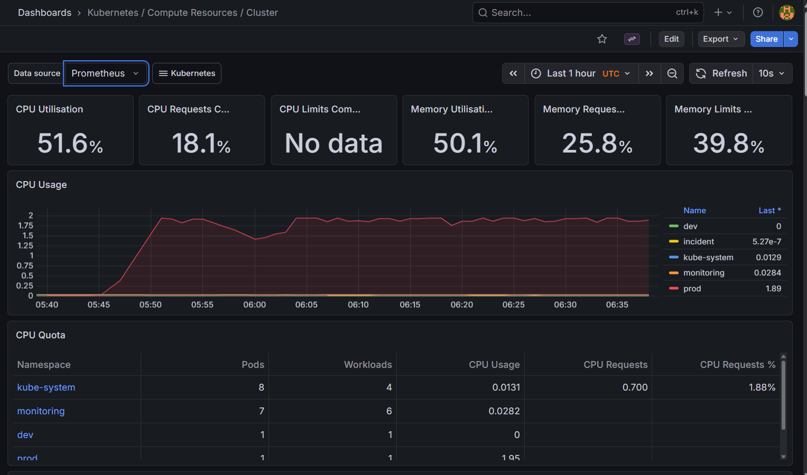
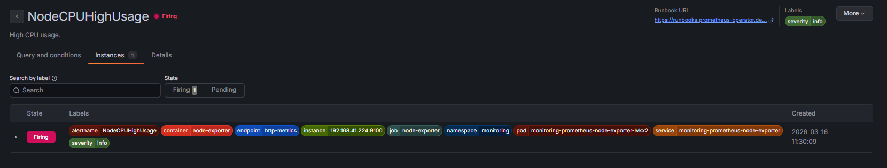
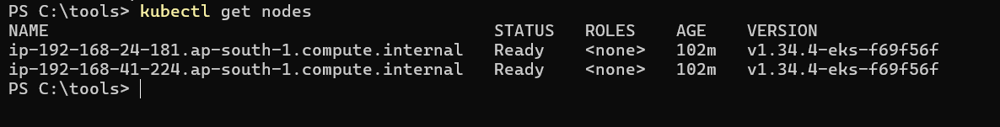
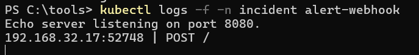

## 📊 Architecture

Application → Prometheus → Alertmanager → Webhook → Incident System

---

## 📸 Screenshots

### 📈 Grafana Dashboard

### 🚨 Alert Firing

### ☸️ EKS Cluster

### 🔔 Incident Webhook

---

## ⚙️ Features

- Kubernetes cluster monitoring
- Custom Prometheus alert rules
- Grafana dashboards for observability
- Alertmanager routing
- Incident automation via webhook
- Multi-environment support (dev/prod)

---

## 🚨 Alerts Implemented

- High CPU usage
- Node CPU saturation
- Instant test alert
- Pod restart detection

---

## ?? Incident Workflow

1. CPU spike detected
2. Prometheus evaluates metrics
3. Alert rule triggers
4. Alertmanager routes alert
5. Webhook receives POST request
6. Incident system can create ticket

---

## 💡 Use Case

Designed for startups needing:

- Kubernetes monitoring setup
- Production alerting system
- Incident automation
- Reliability engineering support
=======
# kubernetes-observability-platform
Kubernetes monitoring using Prometheus, Grafana, Alertmanager with incident automation
>>>>>>> 6ef8bb1635525968167e00895a7907e031abb63e
